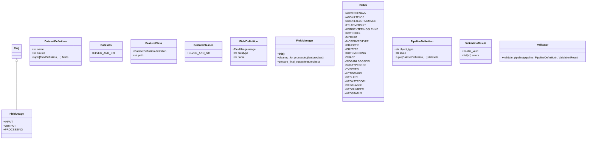

# Class Hierarchy

```mermaid
classDiagram
    Flag <|-- FieldUsage

    class DatasetDefinition {
        +str name
        +str source
        +tuple[FieldDefinition, ...] fields
    }

    class Datasets {
        +ELVEG_AND_STI
    }

    class FeatureClass {
        +DatasetDefinition definition
        +str path
    }

    class FeatureClasses {
        +ELVEG_AND_STI
    }

    class FieldDefinition {
        +FieldUsage usage
        +str datatype
        +str name
    }

    class FieldManager {
        +__init__()
        +cleanup_for_processing(featureclass)
        +prepare_final_output(featureclass)
    }

    class FieldUsage {
        +INPUT
        +OUTPUT
        +PROCESSING
    }

    class Fields {
        +ADRESSENAVN
        +ADSKILTELOP
        +ADSKILTELOPNUMMER
        +FELTOVERSIKT
        +KONNEKTERINGSLENKE
        +KRYSSDEL
        +MEDIUM
        +MOTORVEGTYPE
        +OBJECTID
        +OBJTYPE
        +RUTEMERKING
        +SHAPE
        +SIDEANLEGGSDEL
        +SUBTYPEKODE
        +TYPEVEG
        +UTTEGNING
        +VEDLIKEH
        +VEGKATEGORI
        +VEGKLASSE
        +VEGNUMMER
        +VEGSTATUS
    }

    class PipelineDefinition {
        +str object_type
        +str scale
        +tuple[DatasetDefinition, ...] datasets
    }

    class ValidationResult {
        +bool is_valid
        +list[str] errors
    }

    class Validator {
        +validate_pipeline(pipeline: PipelineDefinition) ValidationResult
    }

```