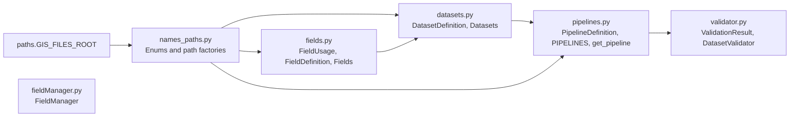
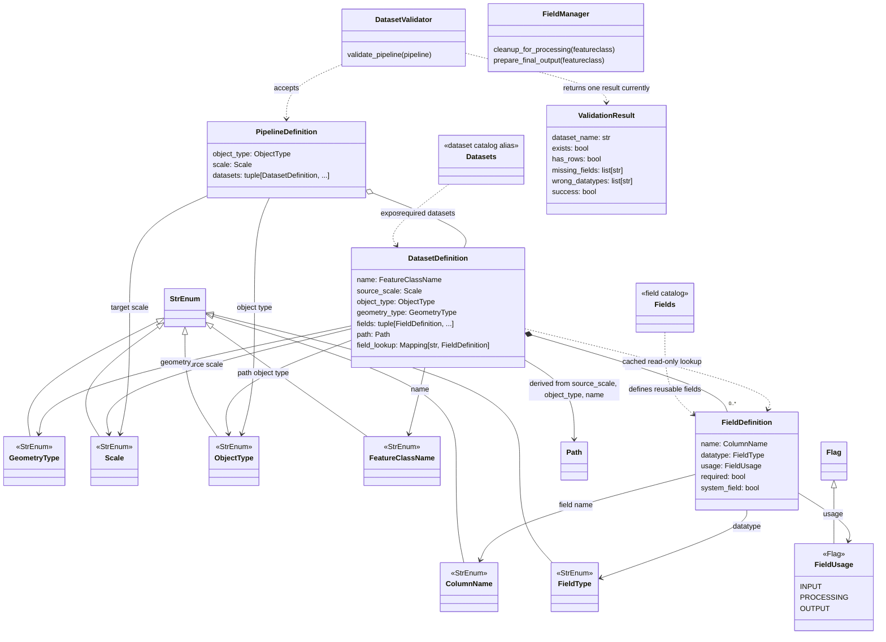

# Data Orchestrator 2

`data_orchestrator_2` is a metadata catalog for generalization pipelines. A caller selects a pipeline by `(object_type, scale)`; the pipeline definition lists its datasets, and each dataset definition describes its name, source scale, path object type, geometry, derived path, and fields. The target scale on a pipeline and the source scale on a dataset are separate values.

The intended access path is:

```text
(object type, target scale)
          |
          v
       Pipeline
          |
          +----> Dataset definition ----> source path
          |                |
          |                +-------------> field definitions
          v
   all required datasets
```

## Quick Start

```python
from data_orchestrator_2.names_paths import ObjectType, Scale
from data_orchestrator_2.pipelines import get_pipeline

pipeline = get_pipeline(ObjectType.ROAD, Scale.N100)

for dataset in pipeline.datasets:
    print(dataset.name, dataset.path)
```

`get_pipeline` uses a dictionary keyed by `(ObjectType, Scale)`, so pipeline selection is an average O(1) lookup. An unknown key currently raises `KeyError`.

## Structure



The arrows show imports and construction dependencies. In particular, `DatasetDefinition` gets its enums and calls the path factory in `names_paths.py`; that module imports `paths.GIS_FILES_ROOT`, so importing the catalog eagerly loads the project path configuration. `FieldManager` is currently independent: it has no imports or implemented connections to the rest of the package. `test.py` is a manual print/demo script, not an automated test.

## How Definitions Connect



`FieldUsage` is a `Flag`, so a field can carry more than one role. `required` controls whether a schema field must be present; `system_field` labels fields such as `OBJECTID` and `SHAPE`. These are separate from usage. The current catalog marks every field, including both system fields, as required input.

## Module Guide

| Module | Responsibility |
| --- | --- |
| `names_paths.py` | Shared enums and factories for geodatabase and feature-class paths. |
| `fields.py` | `FieldUsage`, immutable `FieldDefinition`, and reusable field constants in `Fields`. |
| `datasets.py` | Dataset metadata, its fields and path, and the `Datasets` alias namespace. |
| `pipelines.py` | Pipeline metadata, the `(object_type, scale)` index, and `get_pipeline`. |
| `validator.py` | Validation result model and a placeholder pipeline validation entry point. |
| `fieldManager.py` | Planned field cleanup and output preparation operations; currently stubs. |

The path helpers use `GIS_FILES_ROOT` from the top-level `paths.py`. That module loads `.env` and requires `DEFAULT_PROJECT_WORKSPACE`, `GIS_FILES_ROOT`, and `PYTHONPATH` when imported. As a result, importing these metadata modules requires path configuration even when only enum values are needed. `DatasetDefinition.path` is computed from its `source_scale`, `object_type`, and `name`; callers cannot pass a separate path.

## Current Example

The current catalog contains one pipeline and one registered dataset:

```text
(ROAD, N100) -> N100_ROAD -> ELVEG_AND_STI
                                  source scale: RAW_DATA
                                  geometry: POLYLINE
                                  path: built from RAW_DATA + ROAD + ELVEG_AND_STI
                                  fields: 21 definitions
```

`PIPELINES` indexes the pipeline by `(ObjectType.ROAD, Scale.N100)`, and its dataset tuple contains `Datasets.ELVEG_AND_STI` directly. That dataset has source scale `RAW_DATA`, path object type `ROAD`, polyline geometry, and 21 field definitions. `DatasetDefinition` normalizes fields to a tuple, rejects duplicate field names, and builds a read-only lookup map once.

## Structure Review

The core catalog path is in place: pipeline selection is a dictionary lookup and its dataset definitions carry the metadata needed for downstream work. The current implementation has these useful properties and gaps:

- **`Datasets` is the catalog namespace:** Each definition is exposed as a class attribute, keeping imports stable as the catalog grows.
- **Path consistency is enforced at construction:** Callers cannot supply `path`; it is derived from `source_scale`, `object_type`, and `name`. Add new dataset locations through those fields rather than constructing paths separately.
- **Environment configuration is eager:** Importing `names_paths.py` imports `paths.py`, which requires all three project path variables at module import. Consider separating pure enums from path configuration or injecting a path root when building the catalog.
- **Field lookup is cached and read-only:** `DatasetDefinition` builds the lookup map once and exposes it through a read-only mapping. Duplicate field names are rejected during construction. The fields are keyed by their `ColumnName` string values.
- **Validation is only a placeholder:** `validate_pipeline` currently returns one hard-coded failure result, using only the first dataset name (or an empty string). Its singular `ValidationResult` cannot represent every dataset in a multi-dataset pipeline. `FieldManager.cleanup_for_processing` and `prepare_final_output` are also stubs.
- **Result immutability is shallow:** `ValidationResult` is frozen, but its `list[str]` members can still be mutated. Tuples would make the result deeply immutable and align with the catalog's tuple-based collections.
- **Usage flags are ahead of the data:** The field model supports input, processing, and output roles, but every field in the current dataset is marked `INPUT`.
- **No focused automated tests are configured:** `data_orchestrator_2/test.py` is a manual demo, and pytest's configured test roots do not include this package. The pipeline index, dataset paths, field metadata, and validator currently lack focused automated contract checks.
- **Static checking does not cover this package:** The repository's Pyright include roots are `src`, `tests`, and `tools`, so these modules are outside its configured project check.

## Improvement Suggestions and Validator Implementation

Keep `Datasets` as the stable namespace and retain direct pipeline lookup by `(ObjectType, Scale)`. Grow the catalog through definitions rather than duplicating paths or field lists in consumers. The following changes are the most useful next steps:

1. **Make the validator report each dataset.** `ValidationResult` contains a `dataset_name` and per-dataset checks, so change `validate_pipeline` to return `tuple[ValidationResult, ...]`, with one result for every entry in `pipeline.datasets`. Alternatively, introduce a separate pipeline result that contains all dataset results and an aggregate success value; do not silently validate only the first dataset. Define behavior for an empty pipeline explicitly.
2. **Use ArcPy for geodatabase-aware checks.** A feature class inside a file geodatabase is not reliably validated with `Path.exists()`. For each dataset, use `arcpy.Exists(str(dataset.path))`. If it is absent, report `exists=False`, `has_rows=False`, and skip schema/count inspection. Otherwise, use `arcpy.ListFields` to compare required catalog fields and their ArcPy field types, `arcpy.Describe` to compare `shapeType` with `dataset.geometry_type`, and `int(arcpy.management.GetCount(str(dataset.path))[0]) > 0` to set `has_rows`.
3. **Keep type and success semantics explicit.** Map the catalog's `TEXT`, `DOUBLE`, `OID`, and `GEOMETRY` types to ArcPy's `String`, `Double`, `OID`, and `Geometry` field types. Normalize case or map values explicitly when comparing: `POINT`/`point` to `Point`, `POLYLINE`/`polyline` to `Polyline`, and `POLYGON`/`polygon` to `Polygon`. Validate shape geometry separately from the `SHAPE` field's `Geometry` datatype. Use `field.required` to select required schema fields; do not infer requiredness from `FieldUsage` or `system_field`. Decide whether an empty dataset is a validation failure: a useful default is for `success` to mean the dataset exists and its required schema/geometry is valid, with `has_rows` reported independently so a caller can impose a non-empty-input policy.
4. **Return useful diagnostics and preserve errors.** Populate `missing_fields` and `wrong_datatypes` with field names (or change the result model to include expected/actual types). Do not broadly catch ArcPy exceptions and turn them into ordinary `False` values; either propagate inspection failures or add an explicit error diagnostic to the result so callers can distinguish invalid data from an inaccessible workspace or ArcPy failure.
5. **Keep ArcPy calls testable.** Put the ArcPy inspection behind a small injected inspector/adapter, or isolate the calls in narrow helpers that tests can replace. Unit-test missing datasets, empty and non-empty datasets, missing optional versus required fields, datatype mismatches, geometry mismatches, and multiple datasets. Then add focused tests for the existing catalog contracts (lookup, derived paths, duplicate rejection, and read-only field lookup) and include this package in pytest/Pyright only if it is intended to be maintained as part of the checked application.

The repository already has `custom_tools/general_tools/validation.py` with `arcpy.Exists` and `GetCount` checks. It is useful as a reference for ArcPy operations, but its broad exception handling discards failure details; the new validator should preserve those details rather than copying that behavior.
