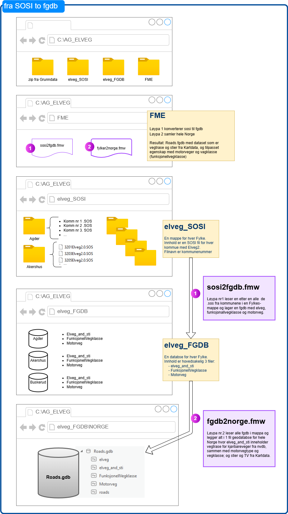

= Metodologi-dokumentasjon

[cols="2,2"]
|===
| Dato | bidragsytre

| 25.03.2025 | Virginia Antonijevic, Elling Aronsen Oftedal og Ida Hope Barth
|===

= Introduksjon

Denne metodologidokumentasjonen beskriver prosessen og metodene som ble brukt for å utvikle en automatisk generaliseringsløype for vegdata fra Nasjonal Vegdatabank (NVDB) til N100K, et kartdatasett tilpasset en målestokk på 1:100 000. Målet med prosjektet var å oppdatere eller erstatte den eksisterende modellen med en ny modell som skulle gi et bedre kartografisk resultat enn den forrige versjonen fra 2018.

I den første versjonen av N100K ble N50K benyttet som kilde for å forenkle harmoniseringen med de øvrige målestokkene. Dette valget ble tatt med tanke på at N50K skulle være den primære kilden der det var mulig. Imidlertid oppstod det utfordringer med å skille mellom viktige og mindre viktige veger, noe som er en grunnleggende forutsetning for automatisk generalisering. Resultatene fra N50K oppfylte ikke de ønskede kravene, og det ble derfor nødvendig å se etter andre kilder for å oppnå bedre resultater.

I forbindelse med oppdateringen av modellen for 2024/2025 ble NVDB, sammen med N50K, vurdert som potensielle kilder for generaliseringen av veiene til N100K. NVDB er et nasjonalt system i Norge for lagring, forvaltning og tilgjengeliggjøring av vegrelaterte data. Det inneholder svært detaljert informasjon om det norske vegnettet og er et viktig verktøy for veg- og transportforvaltning i Norge. Ved å bruke NVDB som kilde, kunne vi dra nytte av dens detaljerte data og hierarkiske struktur for å utvikle en robust og nøyaktig generaliseringsmodell.

Denne dokumentasjonen vil gå i detalj på de metodene og teknikkene som ble brukt, inkludert valg av kilder, hierarkisk strukturering, og oversettelse fra NVDB-språk til N100K. Videre vil vi diskutere de ulike verktøyene og parameterne som er vurdert og enten avvist eller tatt med i den ferdige modellen, samt tiltak for å sikre stabilitet og nøyaktighet.

= Kilde
I arbeidet med å utvikle en automatisk generaliseringsløype for vegdata fra NVDB til N100K, vurderte vi flere potensielle kilder for generaliseringen. De viktigste kildene vi vurderte var N50K, og ulike uttrekk fra NVDB. Hver av disse kildene har sine fordeler og ulemper, og vi gjennomførte en grundig evaluering for å finne den mest egnede kilden for vårt formål.

== N50K
Som nevnt i innledningen har N50K for lite differensiering mellom viktige og mindre viktige veger, og er derfor ikke ønsket som kilde for de automatiske generaliseringsrutinene.

== NVDB og Vegtrase
Etter en grundig vurdering av ulike uttrekk/produkter fra NVDB, valgte vi å bruke vegtrase fra NVDB som utgangspunkt for generaliseringen. Vegtrase representerer en konstruert senterlinje som den fysiske veien ikke nødvendigvis følger, spesielt ved fysisk adskilte kjørebaner. Dette valget ble gjort fordi vegtrase allerede er forenklet og danner et fint grunnlag for videre generalisering til 1:100 000 målestokk. Det er viktig å merke seg at vegtrase eksisterer i NVDB og ikke i Elveg, og vi måtte derfor ta et eget uttrekk fra NVDB.

Vi anser at vegtrase passer godt som utgangspunkt for generaliseringen, da det gir oss en nøyaktig og brukervennlig representasjon av vegnettet, samtidig som det forenkler prosessen med å skille mellom viktige og mindre viktige veier.

=== Hierarki
I arbeidet med å utvikle en automatisk generaliseringsløype for vegdata fra NVDB til N100K, var det viktig å etablere et hierarki for vegene. Hierarkiet hjelper oss med å skille mellom viktige og mindre viktige veger, og sikrer at kartdataene gir en nøyaktig og brukervennlig representasjon av vegnettet.

==== Vurdering av Hierarkier
Vi vurderte flere hierarkier for å diffrensiere vegene. De hierarkiene vi vurderte var vegkategori, funksjonellvegklasse og funksjonsklasse.

===== Vegkategori
Vegkategori beskriver hvem som eier veien og ble brukt i den første versjonen da vi hadde N50K som utgangspunkt. Imidlertid ga vegkategori, spesielt i Oslo, et dårlig skille mellom viktige og mindre viktige veger, og alt for mange veger ble beholdt under generaliseringen.

===== Funksjonellvegklasse
FunksjonellVegklasse, som er basert på ruting, gir en verdi mellom 1 og 9 for å indikere viktigheten av vegene. Spesielt i Oslo gir dette en god differensiering i vegviktighet. Viktigere kommunale veger skilles fra mindre viktige kommunale veger. Da Oslo er både en kommune og et fylke, og de aller fleste vegene er registrert som kommunale, er dette spesielt viktig.

===== Funksjonsklasse
Funksjonsklasse er et annet hierarki som også eksisterer i NVDB. Dette hierarkiet er primært brukt for å differensiere de viktigste veiene, som Europa- og riksveier. De aller fleste av disse veiene blir uansett tatt med i N100K, og vi ser derfor ikke nytten av å bruke dette hierarkiet. Det kan imidlertid være nyttig å se på en kombinasjon mellom FunksjonellVegklasse og funksjonsklasse i fremtiden for å gi en enda bedre differensiering, spesielt hvis vi skulle bruke denne modellen til å generalisere videre til N250K.

===== Viktigheten av Hierarki for ESRI-verktøy
Flere verktøy fra ESRI krever et nyansert hierarki for å kunne utføre nøyaktige utvelgelser. Derfor er det viktig at hierarkiet er godt strukturert, selv om det kan medføre noen ulemper. Et godt strukturert hierarki sikrer at verktøyene kan utføre presise analyser og utvelgelser, noe som er avgjørende for å oppnå et optimalt kartografisk resultat.

Det er imdtlertidig slik at verktøyene fungerer best med maksimalt 5 hierarkiverdier (Se dokumentasjon ESRI) og vi måtte gjøre en vurdering for å optimalisere grupperingen av verdiene. Siden vi ønsker å beholde de viktigste vegene i N100K og at de i utgangspunktet ikke lager for tett vegnett, har vi samlet alle de viktigste vegene i samme hierarkinivå.

Vi har testet ulike varianter av gruppering av funksjonellveiklasse. Kvaliteten på resultatet avhenger av om det er i urbant eller ikke urbant område. Etter mye testing har vi falt på at det som gir best reultat i Oslo, er det vi bruker. Begrunnelsen for valget er at hierarkiet har mer å si for urbane områder der flere veger må fjernes. Spesielt for Oslo er at det er viktig å skille mellom funksjonellvegklasse 5 og 6, som skiller ringvegene fra de resterende kommunale vegene i Oslo.

Flere av ESRI-verktøyene forutsetter et nyansert og gjennomtenkt hierarki for å kunne utføre nøyaktige utvelgelser. Derfor er det avgjørende at hierarkiet er godt strukturert, selv om dette kan medføre enkelte kompromisser. Et solid hierarki legger til rette for presise analyser og utvelgelser, noe som er essensielt for å oppnå et optimalt kartografisk resultat.

Begrensninger og tilpasninger
Ifølge ESRI-dokumentasjonen fungerer verktøyene best med maksimalt fem hierarkiverdier. Dette har krevd en nøye vurdering av hvordan verdiene skal grupperes for å oppnå best mulig funksjonalitet. Ettersom vi ønsker å beholde de viktigste vegene i N100K og disse vanligvis ikke bidrar til et for tett vegnett, har vi valgt å samle dem i samme hierarkinivå.

Testing og valg av gruppering
Vi har testet flere varianter av gruppering basert på funksjonell vegklasse, og resultatene viser at kvaliteten varierer avhengig av om området er urbant eller ikke. Etter omfattende testing har vi valgt den løsningen som gir best resultat i Oslo. Valget er begrunnet med at hierarkiet har størst betydning i urbane områder, der flere veger må filtreres bort for å oppnå ønsket kartografisk uttrykk.

Spesielt for Oslo
I Oslo er det særlig viktig å skille mellom funksjonell vegklasse 5 og 6. Dette skillet er avgjørende for å kunne skille ringvegene fra øvrige kommunale veger, og bidrar til en mer presis og meningsfull kartfremstilling.

[cols="1,7,1"]
|===
| Funksjonell-veiklasse | Beskrivelse | Hierarkiverdi

| 0 | De viktigste vegene i et vegnettverk, f.eks. motorveger. | 1
| 1 | De nest viktigste vegene i et vegnettverk, f.eks. større riksveger.| 1
| 2 | De tredje viktigste vegene i et vegnettverk, f.eks. mindre riksveger. | 1
| 3 | De fjerde viktigste vegene i et vegnettverk, f.eks. større fylkesveger. | 1
| 4 | De femte viktigste vegene i et vegnettverk, f.eks. mindre fylkesveger. | 2
| 5 | De sjette viktigste vegene i et vegnettverk, f.eks. de minste fylkesvegene og viktige kommunale veger. | 2
| 6 | De sjuende viktigste vegene i et vegnettverk, f.eks. kommunale veger. | 3
| 7 | De åttende viktigste vegene i et vegnettverk, f.eks. private og skogsbilveger. | 4
| 8 | De niende viktigste vegene i et vegnettverk, f.eks. veger det ikke er anbefalt å kjøre på, men mulig å kjøre på.| 5
| 9 | De minst viktige vegene i et vegnettverk, f.eks. veger det ikke er anbefalt å kjøre på, men mulig å kjøre på. | 5
|===

For å oppnå stabilitet og effektiv utnyttelse av hierarkiet, har det vist seg nødvendig å kjøre "Thin Road Network"-prosessen i flere omganger. Reduksjonen fra ti til fem hierarkiklasser medfører at stier ikke differensieres tilstrekkelig, noe som gir et for tett nettverk ved målestokk 1:100 000.

Etter gjentatte kjøringer med samme hierarki, gjennomføres en egen "Thin Road Network"-prosess for stier, der alle kjørbare veger er låst. Dette sikrer en generalisering av stinettverket uten at stiene påvirker vegene. Alternativet – å generalisere stiene først og deretter låse dem – resulterte i at enkelte privatveger ble fjernet, mens stiene ble beholdt. Ved generalisering av vegnettet forblir stiene ulåst, men ved målrettet generalisering av stier låses vegene, slik at stier aldri overstyrer kjørbare veger.

Det kan vurderes å skille generaliseringen av kjørbare veger og stier, men dette vil bryte nettverket og svekke overgangen mellom veg og sti.

[cols="4,1"]
|===
| Sti-type |  Hierarkiverdi

| Traktorveg |  1
| Barmerksløyper| 1
|Merket sti - DNT | 2
| Merket sti - Andre |2
|Umerket sti| 3
|Gang og Sykkelveg|4

|===

=== N50K VegSti

Hoveddatakilden for vegnettverket er NVDB. Per i dag er imidlertid dekningen av stier i NVDB ufullstendig. Det pågår et arbeid for å forbedre datagrunnlaget, med mål om at stinett, barmarksløyper og traktorveger skal inngå og ajourføres i NVDB fremover. Inntil dette er på plass, benyttes N50K som supplerende kilde for stier, traktorveger, barmarksløyper og gang- og sykkelveger. Disse datasettene kombineres med kjørbare veger fra NVDB før generaliseringsprosessene igangsettes.

== Tilpassninger
For å få det datasettet vi ønsker må vi hente og sette sammen flere datasett, objekter og verdier. Dette gjøres i en FME-Løype. 

=== NVDB
I førsteomgang har vi fått en tilpasset leveranse fra grunndata med utdrag av NVDB, men vil etter vært koble oss på API for å få fortløpende oppdateringer. Dette utdraget av NVDB inneholder følgene objekter med egne geometrier:

- FunksjonellVegklasse
- Motorveg
- Veglenke/Vegsenterlinje med følgende egenskaper:

   Typeveg = enkelBilveg, rundkjøringer og kanaliserteVeg
   Detaljnivå = vegtrase

Som en del av krevspesifikasjonen så kreves subtypekode som en egenskap i resultatet. NVDB har ikke subtypekode og dette kodes om i FME.

=== N50K
Vi henter ut alle ikke kjørbare veier fra N50K, siden N50K er den mest oppdaterte kilden til dette formålet.

- Vi henter ut alle veger/sti som ikke bilveg er med følgene egenskaper:

OBJTYPE = Sti, Traktorveg, Barmarksløyper og GangogSykkelveg
   
Deretter får veglenke nye egenskaper overført fra objektene funksjonellvegklasse og motorvegtype. Alle Europa- og Riksveier som ikke overlapper med Motorveg fra NVDB får MOTORVEGTYPE = ikke motorveg slik som kravspesifikasjonen krever. 

Merk: Inntil videre må klassifisering av motorveg oppdateres manuelt, ettersom definisjonen i kartproduktene ikke er i samsvar med motorvegklassifiseringen i NVDB

= Smidig tilnærming eller stabil leveranse
Opprinnelig var målet vårt å levere en versjon så snart vi hadde oppfylt de primære kravene for N100K veg. Dette fordi N100K veg ikke har blitt oppdatert på to år, og den forrige versjonen ikke fungerer med nyere versjoner av ArcGIS Pro. Det har imidlertid vist seg at alle mottakerne våre foretrekker en stabil leveranse, der utvelgelsen av veger ikke endrer seg vesentlig fra første til andre versjon. Etter å ha klargjort dette leveransekravet, har vi gjort en grundig testing for å finne en løsning som gir konsistente resultater.

=== ESRI-Verktøy
Basert på dokumentasjonen for ESRI-verktøyene har vi en tydelig forventning til resultatene. I praksis viser det seg imidlertid at de kartografiske algoritmene fungerer som «svarte bokser» og gir varierende resultater uten konsistens. Dette skaper både faglige utfordringer og bekymring.
Dialog med ESRI sentralt har avdekket at algoritmene i enkelte tilfeller kan feile uten å generere feilmeldinger. For å redusere risikoen for slike feil, anbefales det å benytte små partisjoner. På bakgrunn av dette har vi optimalisert modellen med mål om å oppnå størst mulig konsistens i resultatene.
I kravspesifikasjonen er det definert at ved to kjøringer med identisk kildegrunnlag skal minimum 95 % av resultatene være geometrisk like.

=== Optimalisering 
For å optimalisere stabiliteten til modellen har vi gjennomført grundige undersøkelser av følgende parametere:

- Partisjonsstørrelse
- Faste partisjoner eller skalerbare partisjoner
- Bufferavstand rundt partisjoner
- Flere kjøringer av ikke-deterministiske verktøy fra ESRI

==== Fremgangsmåte
Etter dialog med ESRI sentralt har det blitt tydelig at verktøyet krever mindre partisjoner med færre objekter enn det som fremgår av den offisielle dokumentasjonen. Gjennom omfattende testing har vi identifisert flere parametere som påvirker modellens stabilitet. Disse er testet individuelt, men det er nødvendig at alle inngår i en balansert kombinasjon for å oppnå konsistente resultater.

- Iterativ kjøring av "Thin Road Network
Den mest kritiske faktoren er gjentatt kjøring av verktøyet "Thin Road Network". Selv om dette ikke er dokumentert av ESRI, viser erfaring at flere iterasjoner er nødvendig for å nærme seg en deterministisk modell. Vi har testet opptil syv kjøringer. Ved kun én kjøring oppnås ikke konsistens, uavhengig av partisjon eller bufferstørrelse. Prosessen avsluttes når antall vegsegmenter forblir uendret mellom to påfølgende iterasjoner.

- Partisjonsstørrelse og prosesseringskapasite
Det foreligger ingen offisiell dokumentasjon som angir hvor mange vegsegmenter eller vertices som kan prosesseres samtidig. Basert på omfattende testing er det imidlertid indikasjoner på at systemet håndterer opptil rundt 100 000 vegsegmenter før ytelsen blir upålitelig.

I den innledende fasen ble det valgt å prosessere et begrenset antall vegsegmenter for å sikre et konsistent og pålitelig resultat. Etter overgang til en iterativ kjørestrategi for "Thin Road Network"-prosessen, ble det mulig å håndtere et større datavolum uten å kompromittere stabiliteten. En kjent utfordring med "Thin Road Network" er at prosessen kan avsluttes uventet uten feilmelding, særlig når antallet vegsegmenter overstiger en viss grense. Dette gjør det krevende å identifisere feilårsaker og stille presise krav til datamengde.

For å oppnå en konsistent generalisering er det avgjørende å inkludere tilstrekkelig kontekst rundt de vegsegmentene som skal videreføres. Dette omfatter både segmenter som inngår i den endelige modellen og tilstøtende veger som bidrar til å bevare strukturelle og geografiske sammenhenger. Bufferavstanden benyttes her som et verktøy for å definere hvor mye kontekst som skal inkluderes i hver iterasjon. Partisjonsmodellen er konstruert med klare begrensninger, slik at den totale mengden data – både for kontekst og for veggeneralisering – aldri overskrider den fastsatte maksimalverdien. Dette sikrer at prosesseringen holder seg innenfor systemets kapasitetsgrenser og bidrar til en robust og skalerbar arbeidsflyt

- Bufferens betydning
Uten buffer behandles vegsegmenter i ytterkantene av en partisjon som endelinjer, noe som gir inkonsistent generalisering. For at output skal representere kjernen i et større sammenhengende vegnett, må vegene prosesseres med tilstrekkelig kontekst. Testing med bufferstørrelser fra 1 000 til 5 000 meter viste at en buffer på 5 000 meter gir mest stabile og gjentakbare resultater, spesielt ved iterativ kjøring.

==== Ettertanke
Etter optimaliseringen oppstod en faglig diskusjon om behovet for faste partisjoner. Modellen er i utgangspunktet dynamisk og beregner partisjoner basert på antall vegsegmenter i datakilden. Dersom kilden forblir uendret, vil også partisjonene være stabile. Ved endringer i datagrunnlaget tilpasses partisjonene automatisk.
Gjennom omfattende testing har vi observert at faste partisjoner kan gi mer konsistente resultater, selv om det er utfordrende å kvantifisere effekten. Diskusjonen dreier seg i hovedsak om at endringer i kilden også endrer forutsetningene for generaliseringen. Ved bruk av faste partisjoner mister vi kontroll over maksimalmengden vegsegmenter per partisjon, noe som kan påvirke modellens stabilitet.
På bakgrunn av dette er det besluttet å fokusere på optimalisering av tre sentrale parametere: antall linjer/vertices per partisjon, bufferavstand, og antall iterasjoner med "Thin Road Network".

= Oppbyggning av modell

Målet for N100K veger er å vise vegnettet og de viktige gjennomgående vegene. Det er fokus på at de viktigste vegene som motorveger, europaveier, riksveier skal med, men at kommunale og private er med for å gi inntrykk av tetthet i vegnettverket.

I sammenligning med N50K må kryss og på- og avkjøringsramper forenkles, rundkjøringer enten forstørres eller fjernes, og den generelle tettheten av veier må reduseres.

== Forenklet forklaring på modellen
Selve scriptet dokumenterer i detalj oppbygningen av modellen, men for ikke programmeringsdyktige kommer en forklaring på modellen under. Se til GitHub for åpen kildekode for alle detaljer: https://github.com/kartverket/automatisk-generalisering

=== Datatilpasning
Vi benytter to kilder som hentes og tilpasses for videre bruk i automatisk generalisering. Disse kildene inkluderer veinettet fra NVDB, som for øyeblikket leveres som en spesialleveranse fra grunndata, og N50K VegSti. Tilpasningen av disse dataene utføres ikke ved dokumentert kode i GitHub, men vil bli lagt til der i ettertid.

I dag brukes FME-løype (ansvarlig for modell, Virginia Antonijeciv)

==== Beskrivelse av datatilpasningen
Første del innebærer en prosess hvor .zip-filer med kommunevis sosi-filer eksporteres fra Grunndata. Disse filene inneholder elvegdata på alle nivåer, inkludert vegtrase. Deretter pakkes filene ut til fylkesvise mapper, med en sos-fil for hver kommune. Videre konverteres sosi-filer til fgdb-format og kombineres med objekter fra Kartdata, og skaper en fgdb for hvert fylke med funksjonell vegklasse, motorveg og "elveg og sti". Fra elveg inkluderes kun kjørbare veger, ikke vegtyper som fortau og trapp, mens Kartdata bidrar med alt unntatt bilveger, som sti, traktorveg, barmarksløype og gang- og sykkelveg. Deretter settes hele landet sammen der egenskaper fra funksjonellvegklasse og motorvegtype overføres til veglenke/vegsenterlinje, og skriver til fgdb som er input til AG. Til slutt utføres en geometrisjekk hvor veglinjen dissolves på tvers av egenskapene og lager kryss etter medium på nytt. Noen egenskaper blir tilpasset for videre bruk.

=== Data tilpasning
Vi benytter to kilder som hentes og tilpasses for videre bruk i automatisk generalisering. Disse kildene inkluderer veinettet fra NVDB, som for øyeblikket leveres som en spesialleveranse fra grunndata, og N50K Sti og traktorveg. Tilpasningen av disse dataene utføres ikke ved dokumentert kode i GitHub, men vil bli lagt til der i ettertid.

I dag brukes FME-løype (ansvarlig for modell, Virginia Antonijeciv)

image::bilder\sositofgdb.png[align="center", alt = Dokumentasjon N100_Vei_FME]

==== Beskrivelse av data tilpasningen
Første del innebærer en prosess hvor .zip-filer med kommunevis sosi-filer eksporteres fra Grunndata. Disse filene inneholder elvegdata på alle nivåer, inkludert vegtrase. Deretter pakkes filene ut til fylkesvise mapper, med en sos-fil for hver kommune. Videre konverteres sosi-filer til fgdb-format og kombineres med objekter fra Kartdata, og skaper en fgdb for hvert fylke med funksjonell vegklasse, motorveg og "elveg og sti". Fra elveg inkluderes kun kjørbare veger, ikke vegtyper som fortau og trapp, mens Kartdata bidrar med alt unntatt bilveger, som sti, traktorveg, barmarksløype og gang- og sykkelveg. Deretter settes hele landet sammen og kombinerer funksjonell vegklasse og motorvegtype, og skriver til fgdb som er input til AG. Til slutt utføres en geometrisjekk hvor veglinjen dissolveres på tvers av egenskapene og lager kryss etter medium på nytt. Noen egenskaper blir tilpasset for videre bruk.

Under er det et bilde av egenskapene til FGDBen "elveg_and_sti" som er utgangspunktet for den automatiske generaliseringsmodellen.

image::bilder\utgangspunkt_fgdb.png[align="center", alt = Utgansgspunkt for videre generalisering]

==== Generalisering

Valg av rekkefølge og bruk av ulike generaliseringsverktøy er basert på ESRI-anbefalinger for veg-generalisering og ved gjentatte tester. Dette er den overordent modellen for Veg-generalisering for N100K.

Valg av rekkefølge og bruk av ulike generaliseringsverktøy er basert på ESRI-anbefalinger for veg-generalisering og ved gjentatte tester. Dette er den overordent modellen for Vei-generalisering for N100K.

[cols="2,4"]
|===
| Verktøy | Hvorfor

| Multipart to singelpart | For å få den rette oppdelingen av vegsegmenter.
| Hierarki | For differansiering mellom viktighet av vei, må vi definere ett hierarki. For kjørbare veier blir hierarkiet bygd fra Funksjonellveiklasse, beskrevet tidligere i dokumentet. Siden Funksjonellveiklasse kun er for veier fra NVDB, brukes veikategori for å sette opp hierakriet for alt untatt bilveger.
| Remove small lines | Fjerner alle linjer under 100 m for å fjerne unødvenig smårusk
| Colapse Road detail | Fjerner de fleste rundkjøringer og annet smårusk
| Simplify | Forenkler linjene ved å fjærne undøvendige punkter i linjen.
| Thin Road network: Vei | Beholder veimønster men fjerner detaljene. 

Dette verktøyet ga i første omgang ulikt resultat for hver gang det kjørte og vi startet arbeidet med å stabilisere resultatet (beskrevet tidligere i dokumentet). Det ble derfor lagd en iterasjon som gjør flere operasjoner i flere omganger, helt til det ikke lenger skjer endring fra omgang til omgang. Under er rekkefølgen beskrevet:

En omgang = +
1) Dissolve +
2) Select & make permanent MEDIUM = U +
3) Select & make permanent MEDIUM = T +
4) Feature to Line ( + delete fields) +
5) Append + 
6) Thin! +

Selv om vi er fornøyd med resultatet er det fortsatt "små trekanter" som burde vært erstattet med enkle kryss. Dette er ikke løst i første versjon, men vi må jobbe med å lage en ekstra løsning for akkurat dette problemet. 

| Thin Road network: Sti| Beholder stimønsteret men fjerner detaljene. 
| Merge Divided Roads| Siden vi bruker Vegtrase som input geometri er mange av veiene allerede en trase. For å ikke slå sammen for mange veier må man angi egenskaper som må være like for at to veier/kjørebaner kan legges sammen til en veg. Det ble testet flere egenskaper, blant annet medium, men dette ble ikke valgt fordi det ble forlite differansiering og litt for mye av det som ikke skulle legges sammen til en veg, ble satt sammen til en veg. Den egenskapen vi falt på var Vegnummer. Det generaliserer i riktig grad i henhold til ønsket resultat, men når vi valgte vegnummer ble det klart at vi måtte kjøre "thin Road Network" før "Merge Divided Roads", for å slippe merging av "ikke" parallelle privat-/kommunalveger der veg-nummereringen kan gå i loop.

image::bilder\MergeDividedRoads.png[align="center", alt = Utgansgspunkt for videre generalisering]

| Smooth Line | For å gjøre vegsegmentene mer naturlige og mindre hakkete.
| Resolve Road Conflict | For å flytte veg vekk fra andre linjer med betydning som f.eks vannkontur eller jernbanelinje.
| Dissolve | For å forenkle vegnettet før leveranse
|===

