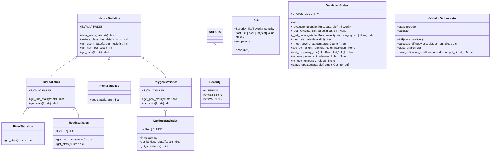

# Class Hierarchy

```mermaid
classDiagram
    LineStatistics <|-- RiverStatistics
    LineStatistics <|-- RoadStatistics
    PolygonStatistics <|-- LanduseStatistics
    StrEnum <|-- Severity
    VectorStatistics <|-- LineStatistics
    VectorStatistics <|-- PointStatistics
    VectorStatistics <|-- PolygonStatistics

    class LanduseStatistics {
        +list[Rule] RULES
        +__init__(scale: str)
        +get_landuse_stats(fc: str) dict
        +get_stats(fc: str) dict
    }

    class LineStatistics {
        +list[Rule] RULES
        +get_line_stats(fc: str) dict
        +get_stats(fc: str) dict
    }

    class PointStatistics {
        +get_stats(fc: str) dict
    }

    class PolygonStatistics {
        +list[Rule] RULES
        +get_poly_stats(fc: str) dict
        +get_stats(fc: str) dict
    }

    class RiverStatistics {
        +get_stats(fc: str) dict
    }

    class RoadStatistics {
        +list[Rule] RULES
        +get_num_types(fc: str) dict
        +get_stats(fc: str) dict
    }

    class Rule {
        +Severity | list[Severity] severity
        +float | int | bool | list[float] value
        +str key
        +str operator
        +__post_init__()
    }

    class Severity {
        +str ERROR
        +str SUCCESS
        +str WARNING
    }

    class ValidationStatus {
        +STATUS_SEVERITY
        +__init__()
        +_evaluate_rule(rule: Rule, data: dict) Severity
        +_get_key(data: dict, value: dict) str | None
        +_get_message(rule: Rule, severity: str, category: str | None) str
        +_iter_rule_data(data: dict) iter
        +_most_severe_status(status: Counter) str
        +add_permanent_rule(rule: Rule | list[Rule]) None
        +add_temporary_rule(rule: Rule | list[Rule]) None
        +remove_permanent_rule(rule: Rule) None
        +remove_temporary_rules() None
        +status_update(stats: dict) tuple[Counter, str]
    }

    class ValidatorOrchestrator {
        +stats_provider
        +validator
        +__init__(stats_provider)
        +calculate_diff(previous: dict, current: dict) dict
        +class_branch(cls)
        +save_validation_results(results: dict, output_dir: str) None
    }

    class VectorStatistics {
        +list[Rule] RULES
        +data_exists(data: str) bool
        +feature_class_has_data(fc: str) bool
        +get_geom_data(fc: str) tuple[int, int]
        +get_num_obj(fc: str) int
        +get_stats(fc: str) dict
    }

```