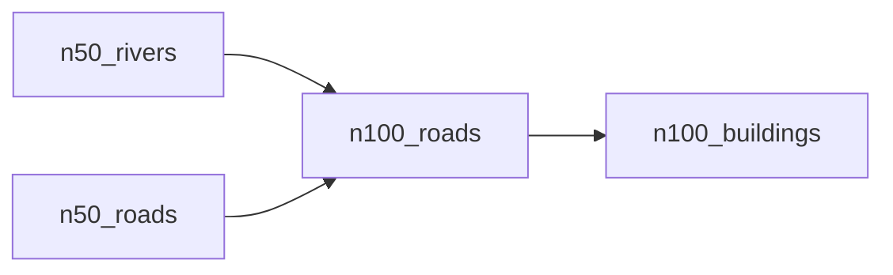

# Pipeline DAG

Source: core/dag/dependencies.yaml

## Scales

```mermaid
flowchart LR
  n100["n100"]
  n250["n250"]
  n50["n50"]
  n50 --> n100
  n100 --> n250
```

## Pipelines

```mermaid
flowchart LR
  n100_buildings["n100_buildings"]
  n100_roads["n100_roads"]
  n50_rivers["n50_rivers"]
  n50_roads["n50_roads"]
  n100_roads --> n100_buildings
  n50_rivers --> n100_roads
  n50_roads --> n100_roads
```

## Stages

```mermaid
flowchart LR
  n100_roads__ramps["n100_roads:ramps"]
  n100_roads__thin_road["n100_roads:thin_road"]
  n100_roads__ramps --> n100_roads__thin_road
```
