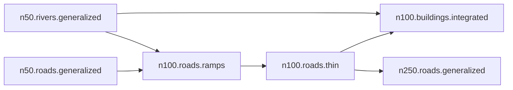

# Dataflow DAG

Source: core/dag/dependencies.yaml
Execution catalog: core/dag/execution_catalog.yaml

## Artifacts (Filenames Only)

```mermaid
flowchart LR
  n100_buildings_integrated["n100.buildings.integrated"]
  n100_roads_ramps["n100.roads.ramps"]
  n100_roads_thin["n100.roads.thin"]
  n250_roads_generalized["n250.roads.generalized"]
  n50_rivers_generalized["n50.rivers.generalized"]
  n50_roads_generalized["n50.roads.generalized"]
  n100_roads_thin --> n100_buildings_integrated
  n50_rivers_generalized --> n100_buildings_integrated
  n50_rivers_generalized --> n100_roads_ramps
  n50_roads_generalized --> n100_roads_ramps
  n100_roads_ramps --> n100_roads_thin
  n100_roads_thin --> n250_roads_generalized
```

## Hierarchy Dependencies

```mermaid
flowchart TB
  subgraph scales["Scale Dependencies"]
    scale__n100["n100"]
    scale__n250["n250"]
    scale__n50["n50"]
    scale__n100 --> scale__n250
    scale__n50 --> scale__n100
  end
  subgraph pipelines["Pipeline Dependencies"]
    pipeline__n100_buildings["n100_buildings"]
    pipeline__n100_roads["n100_roads"]
    pipeline__n250_roads["n250_roads"]
    pipeline__n50_rivers["n50_rivers"]
    pipeline__n50_roads["n50_roads"]
    pipeline__n100_roads --> pipeline__n100_buildings
    pipeline__n100_roads --> pipeline__n250_roads
    pipeline__n50_rivers --> pipeline__n100_buildings
    pipeline__n50_rivers --> pipeline__n100_roads
    pipeline__n50_roads --> pipeline__n100_roads
  end
  subgraph stages["Stage Dependencies"]
    stage__n100_buildings__integrate_roads["n100_buildings:integrate_roads"]
    stage__n100_roads__ramps["n100_roads:ramps"]
    stage__n100_roads__thin_road["n100_roads:thin_road"]
    stage__n250_roads__generalize["n250_roads:generalize"]
    stage__n50_rivers__generalize["n50_rivers:generalize"]
    stage__n50_roads__generalize["n50_roads:generalize"]
    stage__n100_roads__ramps --> stage__n100_roads__thin_road
    stage__n100_roads__thin_road --> stage__n100_buildings__integrate_roads
    stage__n100_roads__thin_road --> stage__n250_roads__generalize
    stage__n50_rivers__generalize --> stage__n100_buildings__integrate_roads
    stage__n50_rivers__generalize --> stage__n100_roads__ramps
    stage__n50_roads__generalize --> stage__n100_roads__ramps
  end
```
